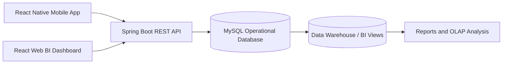

# Architecture BloodBI Analytics

## Modules

- Web: React, Material UI, Recharts
- Backend: Spring Boot, Spring Data JPA, MySQL
- Mobile: React Native Expo
- BI: SQL views and optional Data Warehouse schema

## Main API endpoints

- `POST /api/auth/login`
- `GET /api/dashboard/kpis`
- `GET /api/dashboard/analytics`
- `GET /api/donors`
- `GET /api/requests`
- `GET /api/stocks`
- `GET /api/alerts`
- `GET /api/reports`
